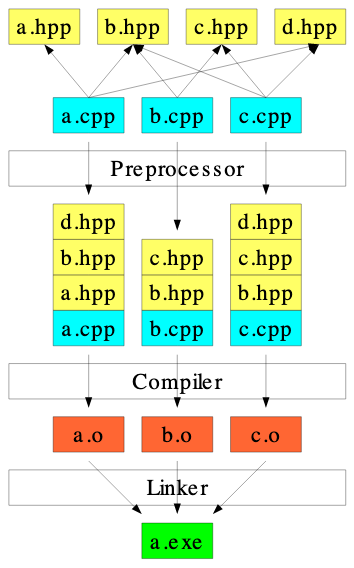

# C++ learning



## Object Files

When you compile a project with `g++`, `g++` actually performs a several distinct tasks:

1) The preprocessor runs and executes any statement beginning with a hash symbol: `#`, such as `#include` statements. This ensures all code is in the correct location and ready to compile.
2) Each file in the source code is compiled into an "object file" (a `.o` file). Object files are platform-specific machine code that will be used to create an executable.
3) The object files are "linked" together to make a single executable. In the examples you have seen so far, this executable is a.out, but you can specify whatever name you want.

It is possible to have `g++` perform each of the steps separately by using the `-c` flag. For example:

```shell
g++ -c main.cpp
```

will produce a `main.o` file, and that file can be converted to an executable with:

```shell
g++ main.o
```

## References

- [#include guard](https://en.wikipedia.org/wiki/Include_guard)
- [Build systems](https://en.wikipedia.org/wiki/List_of_build_automation_software)
- [CMake](https://cmake.org/success/)
